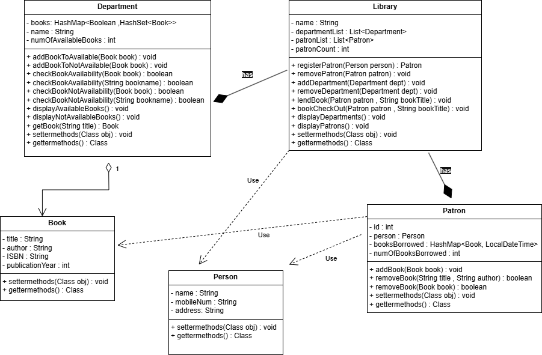

# Library-Management-System

## Class Diagram

## Entities

This Project is built using below 5 entities : 

1. Person
2. Patron
3. Book
4. Department
5. Libray

Library entity is responsible to manage Patron membership, Departments and allows Patron to borrow or checkout any book.

Department entity is responsible to manage Books, maintains the information of available and lent list of books.

Patron enity here uses Person entity to register the Library membership to the Person.

Book and Person entities are low level entities which are used and contained by Library, Department and Patron entities.

## Relationship b/w Entities:

Library and Patron have a strong has-a relationship. A Library has multiple Patrons/Memberships.

Library and Department have a strong has-a relationship. A Library has multiple Departments.

Department and Book have a weak has-a relationship. A Department has multiple Books. Book can exist without Department.

Library and Person have a uses-a relationship. Library uses Person entity for registration to populate Patron entity.

Patron and Person have a uses-a relationship. Patron uses Person entity for binding the membership.

Patron and Book have a uses-a relationship. Patron uses Book entity to enable book borrow and checkout.

